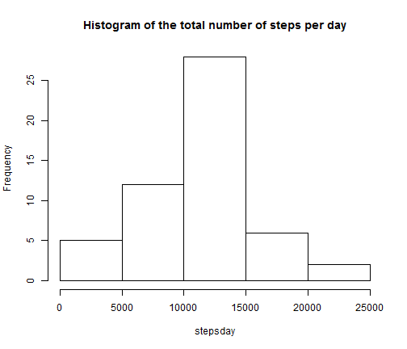
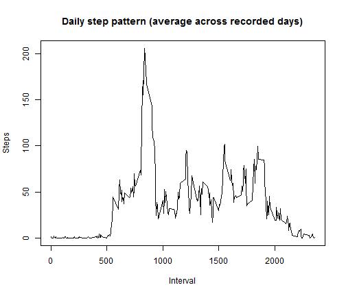
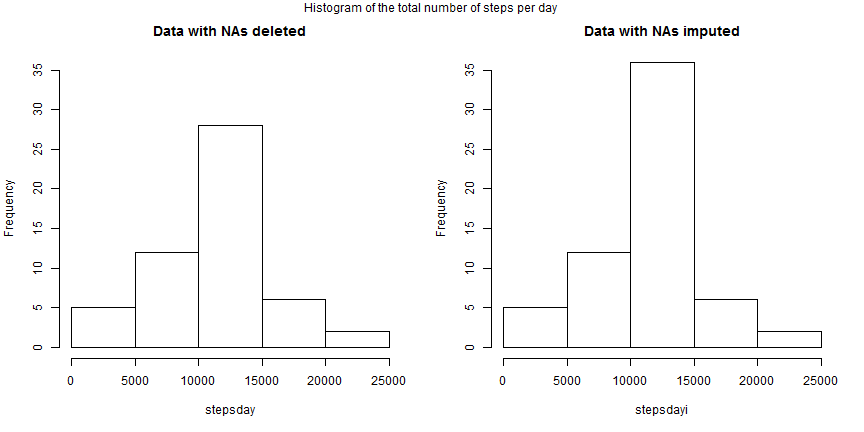
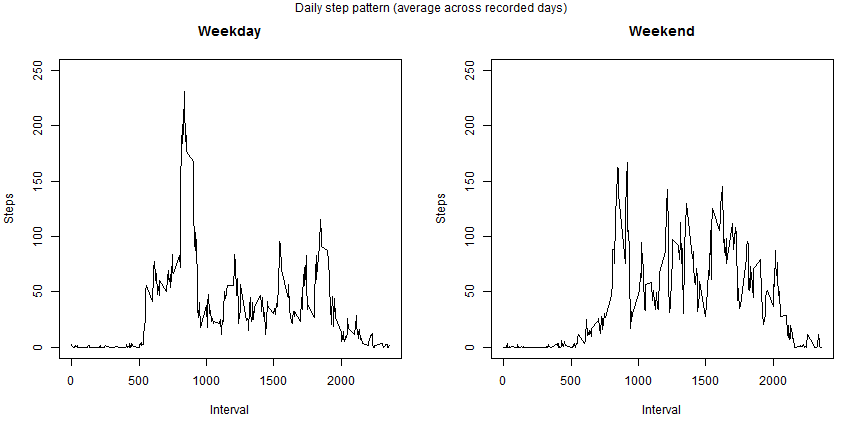

# Reproducible Research: Peer Assessment 1

This is peer assessment #1 for the Coursera class Reproducible Research.


## Loading and preprocessing the data

**(1) Load the data**

This first step is to download the data from the working folder (which is a clone from the GitHub repo) and unzip it. This is done by downloading the zipped file into a temporary file and then unzipping it with the *unz* command.


```r
data <- read.csv(unz("activity.zip", "activity.csv"))
```

**(2) Process/transform the data (if necessary) into a format suitable for your analysis.**

The variables "steps" and "intervals" are already in the correct format (i.e., integers). However, the variable "date" was read as factor and needs to be converted to date format.


```r
data$date <- as.Date(data$date, format = "%Y-%m-%d")
```

Also, it will be useful to prepare a "clean" dataset without missing values, as well as the number of steps per day (of the dataset without NA.


```r
dataclean <- data[!is.na(data[,1]),]
stepsday <- as.matrix(xtabs(steps ~ date, dataclean))
```

## What is mean total number of steps taken per day?

**For this part of the assignment, you can ignore missing values in the dataset.  
(1) Make a histogram of the total number of steps taken each day**


```r
hist(stepsday, main= "Histogram of the total number of steps per day")
```

 

**(2) Calculate and report the mean and median total number of steps taken per day.**


```r
averageday <- mean(stepsday)
medianday <- median(stepsday)
```
The average number of steps taken per day is **1.0766 &times; 10<sup>4</sup>** and the median number of steps per day is **1.0765 &times; 10<sup>4</sup>**.

## What is the average daily activity pattern?

**(1) Make a time series plot (i.e. type = "l") of the 5-minute interval (x-axis) and the average number of steps taken, averaged across all days (y-axis)**


```r
pattern <- as.matrix(with(dataclean, tapply(steps, interval, mean)))
plot(rownames(pattern), pattern, type="l", xlab="Interval", ylab="Steps", main="Daily step pattern (average across recorded days)")
```

 

**(2) Which 5-minute interval, on average across all the days in the dataset, contains the maximum number of steps?**


```r
maximum <- rownames(pattern)[which.max(pattern)]
```

The 5-minute interval with the highest number of steps is the interval "**835**" with 206.1698 steps (on average).

## Imputing missing values

**(1) Calculate and report the total number of missing values in the dataset (i.e. the total number of rows with NAs).**


```r
missing <- sum(is.na(data$steps))
```

There are a total of **2304** missing values in the dataset.

**(2) Devise a strategy for filling in all of the missing values in the dataset. The strategy does not need to be sophisticated. For example, you could use the mean/median for that day, or the mean for that 5-minute interval, etc.**

I choose the strategy to impute the missing values for the average number of steps for that 5-minute interval using the observed values of the dataset. This was calculated in the variable *pattern* calculated above.

**(3) Create a new dataset that is equal to the original dataset but with the missing data filled in.**

This new dataset will be called *imputedata* and it is obtained as follows.


```r
imputedata <- data
for (i in 1:dim(imputedata)[1]) {
    if (is.na(imputedata$steps[i])) {
        imputedata$steps[i] <- pattern[as.character(imputedata$interval[i]), 1]
    }
}
```
**(4) Make a histogram of the total number of steps taken each day and calculate and report the mean and median total number of steps taken per day. Do these values differ from the estimates from the first part of the assignment? What is the impact of imputing missing data on the estimates of the total daily number of steps?**


```r
stepsdayi <- as.matrix(xtabs(steps ~ date, imputedata))
par(mfrow=c(1,2))
hist(stepsday, ylim=c(0,35), main="Data with NAs deleted")
hist(stepsdayi, ylim=c(0,35), main="Data with NAs imputed")
mtext("Histogram of the total number of steps per day", side=3, outer=TRUE, line=-1)
```

 

```r
averagedayi <- mean(stepsdayi)
mediandayi <- median(stepsdayi)
```

As it can be seen, the frequency in the second histogram increases. This happens because the second database is larger (since the missing values are imputed and not deleted). However, the shape between of the two histograms is similar, giving a preliminary indication that deleting the missing data and imputing them with the average across all observed days for the same interval produces comparable results.

To confirm this finding, the following table compares the mean and the median obtained from the two methods of dealing with missing values.

. | NAs deleted | NAs imputed
---|---|---
**Mean** |1.0766 &times; 10<sup>4</sup>      |  1.0766 &times; 10<sup>4</sup>
**Median**  |  1.0765 &times; 10<sup>4</sup>      | 1.0766 &times; 10<sup>4</sup>

The mean is exactly the same for the two methods (in fact, it can be shown that imputing with the mean is equivalent to listwise delete). For the median, the two methods produce slightly different results, but the difference is negligible.

## Are there differences in activity patterns between weekdays and weekends?

**Use the dataset with the filled-in missing values for this part.  

(1) Create a new factor variable in the dataset with two levels - "weekday" and "weekend" indicating whether a given date is a weekday or weekend day.**

The new variable is called *week.of.day* as is concatenated with the imputed dataset.


```r
imputedata$date <- as.Date(imputedata$date, format = "%Y-%m-%d")
week.of.day <- weekdays(imputedata$date) == "Saturday" | weekdays(imputedata$date) == "Sunday"
week.of.day <- as.factor(week.of.day)
levels(week.of.day) <- c("Weekday", "Weekend")
imputedata2 <- cbind(imputedata, week.of.day)
```

**(2) Make a panel plot containing a time series plot (i.e. type = "l") of the 5-minute interval (x-axis) and the average number of steps taken, averaged across all weekday days or weekend days (y-axis)**


```r
patternwkday <- as.matrix(with(imputedata2[imputedata2$week.of.day=="Weekday",], tapply(steps, interval, mean)))
patternwkend <- as.matrix(with(imputedata2[imputedata2$week.of.day=="Weekend",], tapply(steps, interval, mean)))
par(mfrow = c(1,2))
plot(rownames(patternwkday), patternwkday, type="l", xlab="Interval", ylab="Steps", main="Weekday", ylim=c(0,250))
plot(rownames(patternwkend), patternwkend, type="l", xlab="Interval", ylab="Steps", main="Weekend", ylim=c(0,250))
mtext("Daily step pattern (average across recorded days)", side=3, outer=TRUE, line=-1)
```

 

## The end
